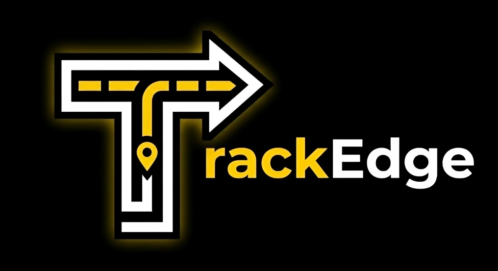

<p align="center">
  
</p>

<h1 align="center">TrackEdge — Live Supply Tracker</h1>

<p align="center">
  A production-ready, multi-tenant logistics platform with real-time GPS tracking, AI-powered ETA prediction, driver management, and an in-app support system.
</p>

<p align="center">
  
  
  
  
  
  
</p>

---

## What is TrackEdge?

TrackEdge is a full-stack SaaS logistics platform where businesses (shops) can register, create shipments, assign drivers, and let customers track deliveries in real time — all on a single unified dashboard.

Each shop gets its own isolated workspace (multi-tenancy). Admins manage their fleet, drivers navigate with live GPS, and customers track packages without needing an account.

---

## Features

**For Admins**
- Register a shop and invite drivers/users via secure one-click links
- Create shipments with Google Places autocomplete and Google Directions route preview
- Assign drivers to shipments, monitor live status, and view analytics
- Manage user roles, toggle account access, and handle support tickets

**For Drivers**
- View assigned deliveries with route details and ETA
- Share live GPS location via Socket.IO — updates the map for all watchers in real time
- Update shipment status (Picked Up → In Transit → Delivered)
- Navigate directly to Google Maps with one tap

**For Customers**
- Track any shipment by tracking number — no account required
- See live driver location on an interactive map with traffic-aware ETA
- Create shipments with AI-calculated ETA and distance
- Submit support tickets and chat with admin in a threaded ticket system

**Platform**
- Real-time notifications (Socket.IO push + 30s polling fallback)
- Redis caching for shipment lists, analytics, and tracking data
- Email OTP verification, password reset, and invite emails via Resend
- IndexedDB-backed form draft persistence (never lose a half-filled form)
- Fully responsive — mobile, tablet, desktop

---

## Tech Stack

| Side | Stack |
|---|---|
| Frontend | React 18, Vite, Tailwind CSS v4, Zustand, Axios, Socket.IO Client |
| Backend | Node.js, Express v5, MongoDB + Mongoose, Redis (ioredis), Socket.IO |
| Maps | Google Maps JS API (admin/driver), Mapbox GL JS (user tracking) |
| ETA | Mapbox Directions API (road distance + duration) |
| Auth | JWT in httpOnly cookie, Email OTP (Resend) |
| Hosting | Vercel (client), any Node host (server) |

---

## Project Structure

```
trackedge/
├── client/          # React + Vite frontend
│   ├── src/
│   │   ├── pages/   # Admin / Driver / User / Public / Auth / Support
│   │   ├── components/
│   │   ├── stores/  # Zustand auth store
│   │   ├── services/ # Axios API + Socket.IO singleton
│   │   └── hooks/   # useAuth, useDraft, useShipments, useSocket, useGeolocation
│   └── README.md
└── server/          # Node.js + Express backend
    ├── controllers/
    ├── models/
    ├── routes/
    ├── services/    # Shipment, Notification, Mapbox ETA
    ├── middleware/
    └── README.md
```

---

## Quick Start

### 1. Clone

```bash
git clone https://github.com/your-username/trackedge.git
cd trackedge
```

### 2. Server

```bash
cd server
npm install
```

Create `server/.env`:

```env
PORT=5000
NODE_ENV=development
MONGODB_URI=mongodb://localhost:27017/supplyTracker
JWT_SECRET=your_secret
REDIS_URL=redis://127.0.0.1:6379
CLIENT_URL=http://localhost:5173
MAPBOX_TOKEN=pk.your_mapbox_token
RESEND_API_KEY=re_your_key
RESEND_FROM=TrackEdge <noreply@yourdomain.com>
```

```bash
npm run dev
```

### 3. Client

```bash
cd client
npm install
```

Create `client/.env`:

```env
VITE_API_URL=http://localhost:5000
VITE_GOOGLE_MAPS_API_KEY=your_google_maps_key
VITE_MAPBOX_TOKEN=pk.your_mapbox_token
```

```bash
npm run dev
```

Open `http://localhost:5173`.

---

## User Roles & Access

| Role | How to get it | Dashboard |
|---|---|---|
| **Admin** | Register a shop at `/register-shop` | `/admin/dashboard` |
| **Driver** | Accept an invite link from admin | `/driver/dashboard` |
| **User** | Register at `/signup` or accept invite | `/user/dashboard` |
| **Anyone** | No account needed | `/track/:trackingNumber` |

---

## How It Works

```
Admin registers shop → Invites drivers via link → Creates shipment (Google Places + Directions)
       ↓
Driver accepts invite → Gets assigned → Shares live GPS via Socket.IO
       ↓
Customer visits /track → Sees live map + ETA → No login required
```

ETA is calculated using the **Mapbox Directions API** for real road distance and drive time. Redis caches tracking data for 30 seconds, shipment lists for 5 minutes.

---

## Screenshots

> Coming soon — or add your own by replacing this section with ``

---

## Contributing

Pull requests are welcome. For major changes, open an issue first to discuss what you'd like to change.

---

## Author

**Himanshu Jha** — Backend Developer · MERN · System Design

---

## License

[MIT](./LICENSE)
